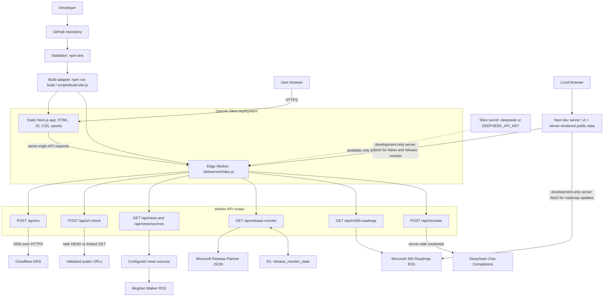

# Pattens infrastructure

**Updated on:** 2026-08-31

This diagram describes the current build and runtime infrastructure. Update both the diagram and the date above whenever a change affects deployment, runtime services, API routes, data stores, secrets, or external integrations.

## Maintenance rule

When an infrastructure-affecting change is made, update this file in the same change set. This includes changes to the build or hosting flow, Worker endpoints, persistent state, secrets, external services, or browser-to-server request paths. Set **Updated on** to the date of that change.
